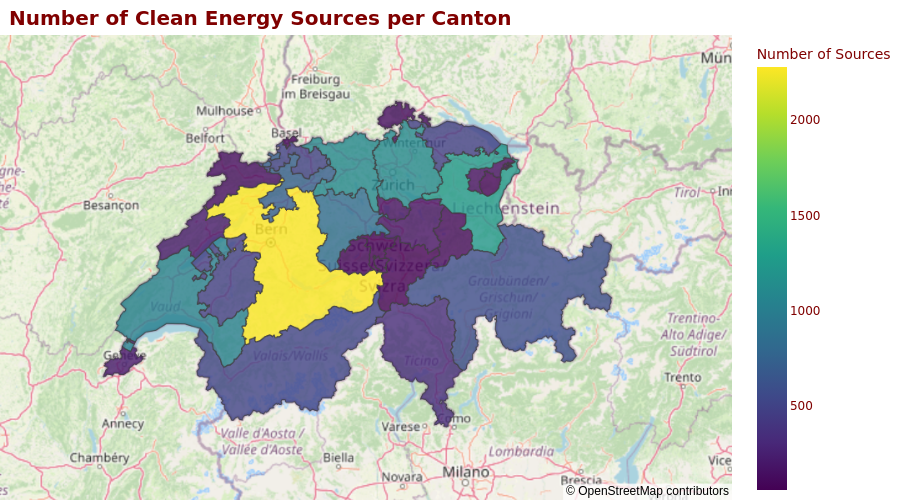

# Renewable Power Plants in Switzerland
## Data Exploration using Plotly and Steamlit

#### -- Project Status: [Active]

## Project Intro/Objective
The purpose of this project is to create an interactive dashboard for exploration of renewable energy sources in Switzerland using Plotly and Streamlit.

### Methods Used
* Data Preprocessing
* Data Visualization

### Technologies
* Python
* Pandas, jupyter notebooks, Plotly
* Streamlit

## Project Description
Data sources:
* CSV file with the dataset of swiss energy sources from: https://data.open-power-system-data.org/renewable_power_plants/                        
* JSON file with coordinates of the Cantons from [here](https://data.opendatasoft.com/explore/dataset/georef-switzerland-kanton%40public/export/?disjunctive.kan_code&disjunctive.kan_name&sort=year&location=8,46.82242,8.22403&basemap=jawg.streets&dataChart=eyJxdWVyaWVzIjpbeyJjb25maWciOnsiZGF0YXNldCI6Imdlb3JlZi1zd2l0emVybGFuZC1rYW50b25AcHVibGljIiwib3B0aW9ucyI6eyJkaXNqdW5jdGl2ZS5rYW5fY29kZSI6dHJ1ZSwiZGlzanVuY3RpdmUua2FuX25hbWUiOnRydWUsInNvcnQiOiJ5ZWFyIn19LCJjaGFydHMiOlt7ImFsaWduTW9udGgiOnRydWUsInR5cGUiOiJsaW5lIiwiZnVuYyI6IkNPVU5UIiwic2NpZW50aWZpY0Rpc3BsYXkiOnRydWUsImNvbG9yIjoiIzE0MkU3QiJ9XSwieEF4aXMiOiJ5ZWFyIiwibWF4cG9pbnRzIjoiIiwidGltZXNjYWxlIjoieWVhciIsInNvcnQiOiIifV0sImRpc3BsYXlMZWdlbmQiOnRydWUsImFsaWduTW9udGgiOnRydWV9)

The goal was to visualize the number of different energy sources per canton on a Plotly choropleth map.

The challenge was to map the cantons between the CSV and the JSON file, as they used different naming (e.g. "ZH" vs. "Zürich").

## Getting Started

1. Clone this repo (for help see this [tutorial](https://help.github.com/articles/cloning-a-repository/)).
2. Data processing and visualisation script is being kept [here](notebooks)
3. Source code for the Streamlit app is being kept [here](src)
4. Feel free to extend the project using your own plots!
5. To deploy your Streamlit app, follow these [instructions](https://docs.streamlit.io/streamlit-cloud/get-started/deploy-an-app)

## Featured Notebooks/Analysis/Deliverables
* [Notebook with data explotation and plots](notebooks/plotting.ipynb)
* [Source code for the Streamlit app](src/app.py)
* See my [Streamlit Dashboard](https://my-first-appapp-lgsepblf4duzksfamhcr2n.streamlit.app/) in action!

### Acknowledgements
This project was initialised during the [Data Science Bootcamp](https://academy.constructor.org/data-science/munich) at [Constructor Academy](https://academy.constructor.org/de).